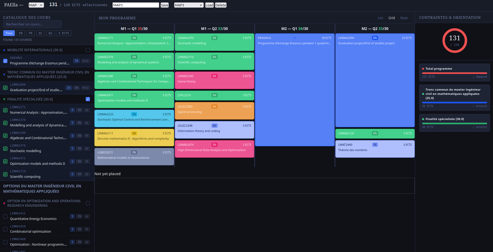

# PAElla - Composeur de PAE

Outil de composition de PAE (Programme Annuel Etudiant) orienté pour les étudiants en Master à l'EPL, UCLouvain.


## Disclaimer
Cet outil n'est pas officiel de l'UCLouvain, certaines conditions et critères peuvent ne pas être repris. Vérifiez toujours les informations sur le site officiel de votre faculté.

## Description

Choississez un programme de Master parmi ceux proposés dans l'onglets "Programmes". Composez ensuite votre PAE en ajoutant les cours qui vous plaisent jusqu'à atteindre le nombre de crédits suffisants. 



## Autres fonctionnalités
- Moteur de recherche et filtres sur le catalogue de cours
- Agencement par quadrimestre des cours dans l'onglet "grid".
- Visualisation des quelques statistiques sur votre programme (profs) dans l'onglet "stats"
- Possibilité de sauvegarder votre progression.


## Setup
Pour lancer l'app en local : 
```bash
git clone "https://github.com/Ledugus/pae-simulator.git" pae-simulator
cd pae-simulator
python3 -m venv .venv
pip install -r requirements.txt
python3 src/seed.py # Setup the database
fastapi dev
```

## Contribuer
Le projet est tout nouveau, n'hésitez pas à proposer des améliorations ou du feedback via une *issue* ou à contribuer à une fonctionnalité avec une *pull-request*.

## TODO:
- Meilleure recherche et filtrage pour naviguer dans le catalogue

Scraping : 
- Scrape prérequis
- Scrape API de l'horaire

Logique de validation : 
- règle de prérequis

UI : 
- Panels ajustables
- Ajouter un widget de prévisualisation de l'horaire
